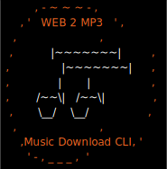

</img>
# Web2mp3 - Music Download CLI
A scalable command line interface to download music from the internet with proper mp3 tagging and directory structuring.
## How to use

**Python Wizard**

Easiest is calling `python main.py` which will start the Python Wizard that will help you provide input:

```python
URL or [Abort]?          https://www.youtube.com/watch?v=NgE5mEQiizQ
Searching Spotify for    Dirty South Hip Hop - Royalty Free Music - Topic
                         1) Dirty South - PANDSHAFT
                         2) Dirty South Hip Hop - Royalty Free Music
Clear Spotify match      Dirty South Hip Hop - Royalty Free Music Instrumentals and Horror Soundscapes - Royalty Free Music
Successfully Created Song DB entry.

URL or [Abort]?          https://open.spotify.com/track/0PCM1aBGD8kGJmBizoW2iM
Searching YouTube for    Dirty South Hip Hop - Royalty Free Music Instrumentals
                         1) Dirty South Hip Hop - Royalty Free Music 
Clear YouTube match      Dirty South Hip Hop - Royalty Free Music
Successfully Created Song DB entry.

URL or [Abort]?          
```

Each call to the Wizard should take about a second, since downloading is performed in the background using a daemon, and mp3 tags are applied.

**Command line calls:**

Alternatively you can call the program straight from the command line. The program does not require URL sanitation (although your shell might):

* Single track call:
  * `python main.py https://www.youtube.com/watch?v=NgE5mEQiizQ`
  * `python main.py https://open.spotify.com/track/0PCM1aBGD8kGJmBizoW2iM`
* Single playlist call:
  * `python main.py https://www.youtube.com/playlist?v=NgE5mEQiizQ`
  * `python main.py https://open.spotify.com/playlist/37i9dQZF1E4ynkTq5aVuVE`
* Multiple calls, separated by spaces:
  * `python main.py https://www.youtube.com/watch?v=NgE5mEQiizQ https://open.spotify.com/track/0PCM1aBGD8kGJmBizoW2iM`

## Supported platforms

URLs from YouTube and Spotify are supported. SoundCloud support is coming soon.

## Directory structuring

Directory structure follows the recommendation by Plex Media Server:<sup>[1](https://support.plex.tv/articles/205568377-adding-local-artist-and-music-videos/)</sup>

```
Music
└───Album Artist
    └───Album Name
        ├───1 - Track Name.mp3
        └───folder.jpg
```


## Backbone

Starts with `youtube_search_python` to identify the video with the given URL. Then uses `spotipy` to get meta data. After which it uses `yt-dlp` to download audio, and finally `eye3d` for handling mp3 tags. `pytube` is optional to get a list of URLS from a playlist. See `requirements.txt`. Tested on Linux and Windows.

## Copyright and use
Audio you download using this script can not contain third-party intellectual property (such as copyrighted material) unless you have permission from that party or are otherwise legally entitled to do so (including by way of any available exceptions or limitations to copyright or related rights provided for in European Union law). You are legally responsible for the Content you submit to the Service. 

