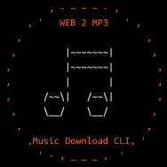

</img>
# Web2mp3 - Music Download CLI
A fully automatic scalable command line interface to download music from the internet with proper mp3 tagging and directory structuring.
## How to use

**Python Wizard**

Easiest is calling `python src/main.py` which will start the Wizard that will 
help you provide input:

```python
>>> URL or [Abort]?      https://www.youtube.com/watch?v=NgE5mEQiizQ
Searching Spotify for    Dirty South Hip Hop - Royalty Free Music - Topic
                         1) Dirty South Hip Hop - Royalty Free Music        100%
                         
Clear Spotify match      Dirty South Hip Hop - Royalty Free Music Instrumenta...
Success: Song DB entry created.

>>> URL or [Abort]?      https://open.spotify.com/track/0PCM1aBGD8kGJmBizoW2iM
Searching YouTube for    Dirty South Hip Hop - Royalty Free Music Instrumental
                         1) Dirty South Hip Hop - Royalty Free Music 	    100%
Clear YouTube match      Dirty South Hip Hop - Royalty Free Music
Success: Song DB entry created.

>>> URL or [Abort]?      
```
Each call to the Wizard should take about a second, since downloading is 
performed in the background using a daemon, and mp3 tags are applied.  

Alternatively you can call the program straight from the command line. The
program does not require URL sanitation (although your shell might):

```
(demo_env) python src/main.py https://www.youtube.com/watch?v=NgE5mEQiizQ
```

**Command Line Arguments**  
Use `src/main.py --help` for parameter options. You can also, after starting the 
wizard -instead of providing a URL- pass `params` to print a list of the current
state of all parameters for inspection.

For example, pass the `quality` flag to set download quality to 123 kB/s, the 
`reponse` flag to set the default response for an unclear match to the first :
(closest match) option, and set the `-d` flag to allow for duplicate songs (e.g,
songs with the same name, for the same author, but on a different album):
```
(demo_env) python src/main.py --quality 123 --response 1 -d`
>>> URL or [Abort]?     params
quality              123
response             1
avoid_duplicates     False
urls                 ()
max_daemons          4
headless             False
init_daemons         During
verbose              False
verbose_continuous   False
tolerance            0.1
market               US
search_limit         5
do_overwrite         False
print_space          24
max_time_outs        10
```
**Suppored URLS**
Both YouTube URLs as Spotify URLs are accepted. My advise is to primarily use 
Spotify URLs, since YouTube URLs can include video clip chatter.   

Both single songs as collections are accepted such as YouTube playlists, Spotify
Playlists and Spotify Albums.

URLs from YouTube and Spotify are supported. SoundCloud support is coming but 
has no priority.

## Get started in 60 Seconds
https://user-images.githubusercontent.com/38399483/234430966-bc7fc4d3-1339-4e9a-97df-a430ecfc70ba.mp4
Commands shown in the video are as follows:
```
git clone https://github.com/MGPoirot/web2mp3.git
cd web2mp3
conda create -n demo_env
conda activate demo_env
pip install -r requirements.txt
python src/main.py
[enter Spotify Client ID and Secret]
https://www.youtube.com/watch?v=N4bFqW_eu2I
```
*Displayed Spotify API credentials have since been deleted.*

## Directory structuring

Directory structure follows the recommendation by Plex Media Server:<sup>[1](https://support.plex.tv/articles/205568377-adding-local-artist-and-music-videos/)</sup>

```
Music
└───Album Artist
    └───Album Name
        ├───1 - Track Name.mp3
        └───folder.jpg
```

## Backbone

Starts with `youtube_search_python` to identify the video with the given URL. Then uses `spotipy` to get meta data. After which it uses `yt-dlp` to download audio, and finally `eye3d` for handling mp3 tags. `pytube` is optional to get a list of URLS from a playlist. See `requirements.txt`. Tested on Linux and Windows.

## Settings
Default settings can be found in the in the `settings.txt` file. Here are options and considerations
### 1. DAEMON settings
In general DAEMONS are headless background processes. For this application,
DAEMONs are used to perform the downloading of audio and cover images, and mp3
meta-data tags.

By performing these tasks in the background, the semi-supervised process of
matching audio with meta-data is not interrupted.

After each match, songs are stored in the song data base (SDB). DAEMONs will
attempt to process any unprocessed song the the SDB and finish when there is
nothing left. Since DAEMONs are headless by default, they store logbooks to the
`.log` directory.

* `init_daemons` When to initiate DAEMONs as string, not case sensitive. 
  Options:
    1. `'during'` or `'d'` (default)  
  
      DEAMONs will start downloading as soon as possible, which
    is the fasted option.
  
    2. `'after'` or `'a'`  
  
      DAEMONS will start downloading after completing the matching process of
    the track URL or playlist URL provided. This can be chosen if due to
      limited computing power, multiprocessing might destabilize your machine.
  
    3. `else`  
  
      Do not automatically initiate DAEMONS. They can then be initiated
      manually by running `python download_daemons.py`.
      You might want to choose this for the same reason as 2) but you also
    have multiple URLs, or if you want to manually want to run
      download_daemons.py in verbose mode and do not want all tasks in the SDB
      to be processed straight away.
  
* `max_daemons`: number of DAEMONS to spawn when download_daemons.py is called.
    Default is `4`. A higher number is faster but requires more computational 
  power.

### 2. Verbose Mode
Since DAEMONS are run in the background by default, you might not immediately
notice errors until checking the logs, and even then see how fast single items
are being processed. Therefor, there is the option to run in verbose mode:


* `verbose` Whether to run in verbose mode. Options are:
    1. `False` (default)   
    Initiate DAEMONS in the background and store logs to .logs directory
    2. `True`   
    Initiate a single process and print the logging data to the console.

* `verbose_single` Whether to only perform a single item when in verbose 
  mode as Boolean
  
    1. `True` (default)   
  
      Only process a single item, then return. If your sole intent is to check 
      if the downloading process succeeds or fails, this is your best 
      option. Afterwards you can continue debugging or running downloads 
      without verbose mode.
    2. `False`     
  
      Keep processing items. If you like looking at every one of your 
      downloads being processed this is your option. This might be usefull 
      when downloads only break every so often and you do no not want to 
      find out later in the logs.

### 3. Matching Settings
An important part of this tool is to match the audio to Spotify meta-data, or
inversely, find the right audio to download to a Spotify track.

* `default_tolerance` Accepted duration difference as float.
    The percentage difference that the Spotify meta-data and the audio can have
    to still be a match as float, default is `0.10` (10% difference)
    A higher percentage decreases the number of false negatives (missed correct
     matches) but increases the chance on false positives (incorrect matches).

* `default_market` The Spotify API market as string.
    Not all tracks are available on every market. This way, the search result
    during matching might not return the expected results. Default is set upon 
    initialization is advised to set this setting to your nationality. See the 
    Spotify API guide for accepted market strings:
    https://engineering.atspotify.com/2015/03/understanding-spotify-web-api/

* `search_limit` The Number of tracks to check for match as integer.
    When matching this is the number of tracks that is compared before
    considering the matching attempt as failed. The default is `5`. Since for each
    matching attempt a single call is made, this increases the API call for all
    matching attempts. A higher number increases the chance of finding a
    acceptable match. However, since results are returned in order of relevance,
    the effectiveness of these comparisons in general decreases, increasing
    compute, computation time, network traffic and chance on time out errors.

* `avoid_duplicates` Whether to skip a track if it exists as Boolean. Options:
    1. `True` (default)   
    By default, we will look in our MUSIC_DIR to see if a track exists already
    using `utils.track_exists`. This avoids downloading the same track twice if
     -for example- the same track has been released as single  on an album, so
     general checking if the file exists is not enough.
    2. `False`   
    The drawback of avoiding duplicates is that -for example- Live versions
    might be skipped if a studio recording of the same track is already in the
    MUSIC_DIR.

### 4. Other
* `print_space` The number of whitespaces used when logging as integer
    This is purely cosmetic to the matching process. Default is `24`. A higher
    number might render the matching process as more clear, but only if your
    screen width can handle it.

* `max_time_outs` The number of attempts when TimeOut as integer
    The Spotify API might return HTTPSTimeOutErrors, not frequently, but it can
    happen. In these cases, we do not want to give up and call the entire
    matching process quits right away. Instead, we wait for a second and try
    again. This number defines how many times we will reattempt before we give
    up. Default is `10`. See also `utils.timeout_handler`.

* `preferred_quality` Audio downloading quality as integer in kB/s
    The benefit of a higher number is higher audio quality, but at the cost if
    increasing file size. Default is `320` kB/s. Common values are 64 (very low
    quality), 128 (low quality), 192 (medium quality), 256 (high quality) and
    320 (very high quality).


## Downloading Age restricted content

Downloading age restricted content from YouTube requires a `www.youtube.com_cookies.txt` cookies file containing the `__Secure-1PSID` cookie. 

[Instructions on how to get this file can be found here](https://github.com/ytdl-org/youtube-dl#how-do-i-pass-cookies-to-youtube-dl). 1. Install extension "Get cookies.txt LOCALLY", 2. Go to YouTube, 3. Open the extension, 4. Export your cookies, 

Place the cookie file anywhere in the web2mp3 home directory with a name ending in `'*_cookies.txt'`. Since these files are private, the `.gitignore` is set up to ignore these files. This is an example of what the cookies file will require to contain:  

```
# Netscape HTTP Cookie File
.youtube.com	TRUE	/	TRUE	2715301110	__Secure-1PSID	
HiIB398G9unpNIO8IBU9ihkb8y7jhv7YIVOB_867vYIVGhuv78_vyuio68_n8og8oV8Log.
```

## Copyright and use
Audio you download using this script can not contain third-party intellectual property (such as copyrighted material) unless you have permission from that party or are otherwise legally entitled to do so (including by way of any available exceptions or limitations to copyright or related rights provided for in European Union law). You are legally responsible for the Content you submit to the Service. 
