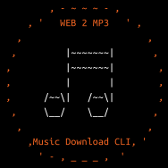

</img>
# Web2mp3 - Music Download CLI
A fully automatic scalable command line interface to download music from the 
internet with proper mp3 tagging and directory structuring.
## How to use

Web2mp3 runs as a Docker container (see "Running with Docker" below for
setup). Once it's up, the everyday commands are:

```
docker compose exec web2mp3 dl --headless <url>
```

Calling `dl` with no URL and not `--headless` starts an interactive
wizard that prompts for URLs one at a time:

```python
>>> URL or [Abort]?      https://www.youtube.com/watch?v=NgE5mEQiizQ
2023-01-01 09:00
Searching Spotify for:  "Dirty South Hip Hop - Royalty Free Music - Topic"
                         1) Dirty South Hip Hop - Royalty Free Music        100%
Clear Spotify match:     Dirty South Hip Hop - Royalty Free Music Instrumenta...
Success:                 Download added "youtube:NgE5mEQiizQ"

>>> URL or [Abort]?     https://open.spotify.com/track/4mn2kNTqiGLwaUR8JdhJ1l                    
2023-01-01 09:00
New spotify URL:         open.spotify.com/track/4mn2kNTqiGLwaUR8JdhJ1l
Searching Youtube for:   "House of the Rising Sun The Animals"
                         1) The House of the Rising Sun                     99%
                         2) The Animals - House Of The Rising Sun (Music Vi 97%
Clear youtube match:     The Animals - House Of The Rising Sun (Music Video) [4K HD]
Success:                 Download added "youtube:N4bFqW_eu2I"
>>> URL or [Abort]?      
```
Each call should take about a second, since downloading is performed in the
background using a daemon, and mp3 tags are applied.

The program does not require URL sanitation (although your shell might).

**Command Line Arguments**  
Use `docker compose exec web2mp3 dl --help` for parameter options. You
can also, after starting the wizard -instead of providing a URL- pass
`params` to print a list of the current state of all parameters for
inspection.

For example, pass the `quality` flag to set download quality to 123 kB/s, the 
`reponse` flag to set the default response for an unclear match to the first :
(closest match) option, and set the `-d` flag to allow for duplicate songs (e.g,
songs with the same name, for the same author, but on a different album):
```
docker compose exec web2mp3 dl --quality 123 --response 1 -d
>>> URL or [Abort]?     params
quality              123
response             1
avoid_duplicates     False
urls                 ()
max_daemons          4
headless             False
init_daemons         During
verbose              False
verbose_continuous   False
tolerance            0.1
market               US
search_limit         5
do_overwrite         False
print_space          24
max_time_outs        10
```

## Functionalities

Web2mp3 aims to be a scalable tool. To this end, three features are paramount:
1) A large range of input sources
2) Reliable matching between audio and meta data
3) Minimal user input
4) Concise managing of downloads

**1. Input Sources**

Both YouTube URLs and Spotify URLs are accepted. SoundCloud support is in
development, to cover audio that is not available through YouTube.

Both single tracks and collections are accepted: YouTube Music playlists,
Spotify tracks, and Spotify albums.

> **Note (early 2026): Spotify playlist support has been removed.**
> In early 2026 Spotify substantially restricted their Web API. The
> `GET /v1/playlists/{id}/items` endpoint now requires user-level OAuth and
> is only accessible for playlists owned by or collaborated on by the
> authenticated user. Development Mode apps additionally require every user
> to be on the app allowlist. As a result, Spotify playlist support has been
> dropped from Web2MP3. **Use YouTube Music playlist URLs instead**
> (`https://music.youtube.com/playlist?list=...`). Spotify track and album
> URLs continue to work normally.

**2. Reliable matching**

Web2mp3 uses two ways to match audio and meta data. First it looks both if the
artist and track name overlap. Second it checks if the durations of the items 
are roughly equal. The acceptable range (as percentage difference) is the 
duration tolerance (see `tolerance` in the CLI argument list). Duration is 
of especial benefit to avoid downloading audio with video clip intro chatter.  

**3. Minimal user input**

In matching the audio the metadata, web2mp3 automatically compares several
items and selects the most appropriate. When no appropriate match could be 
found the user is requested for input. The options are:
* `1-5` Select any item from the list
* `Retry` Give the user an option to type a query to search for
* `Manual` Manually input all meta data information
* `Abort` Cancel download

When running large batches of songs (e.g., a long playlist), it is best to set 
the `--response` flag to either `Abort` or `1`. This way, downloads will be 
added without interruption. If, after this run has completed, you do care about
manually selecting matches that were not matched automatically, you can now 
rerun the previous command and will only be prompted with tracks that could not
be added during the first run.

**4. Concise managing of downloads**

To speed up the downloading process, Web2mp3 stores a download history in the
index (`/src/index/index.sqlite3`, a single SQLite database — earlier
versions stored one file per tracked URI; if you're upgrading from one of
those, run `python src/migrate_index_to_sqlite.py` once to convert your
existing history over before running anything else). Run
`docker compose exec web2mp3 inspect` any time to see how many
tracks are processed vs. still pending. To avoid these checks, the
`--do_overwrite` flag can be passed.
As a final check before downloading , Web2mp3 checks if the song to be 
downloaded does not already exist in the music directory. It does this by
checking if the artist already has a song downloaded containing this song name.
It usually works fine, but in case you want to turn it off you can pass the
`--avoid_duplicates` flag

## Get started in 60 Seconds

1. Clone the repo:
   ```
   git clone https://github.com/MGPoirot/web2mp3.git
   cd web2mp3
   ```

2. Create a Spotify app for API credentials (used to look up track
   metadata): go to https://developer.spotify.com/dashboard and create an
   app, then copy its **Client ID** and **Client Secret**. In that app's
   settings, add `https://maartenpoirot.com/contact` as a **Redirect URI**
   — Spotify requires this exact URI (web2mp3's default login callback) to
   be explicitly allow-listed on your app before login will work. If you'd
   rather use your own redirect page, set `SPOTIPY_REDIRECT_URI` in `.env`
   to it instead and register that one.

3. Configure:
   ```
   cp .env.example .env
   ```
   Edit `.env` and set `HOST_MUSIC_DIR` (where your music library should
   live on this machine) and `SPOTIPY_CLIENT_ID`/`SPOTIPY_CLIENT_SECRET`
   from step 2. Everything else already has a working default (see
   "Running with Docker" below for what each value does).

4. Build and start the container:
   ```
   docker compose up -d --build
   ```

5. Download something. The first real download is also when Spotify's
   one-time browser login happens, so run this one interactively (`-it`,
   no `--headless`):
   ```
   docker compose exec -it web2mp3 dl https://www.youtube.com/watch?v=N4bFqW_eu2I
   ```
   This prints a Spotify login URL — open it in your own browser, log in
   and authorize, then copy the full URL of the page you land on afterward
   and paste it back into the terminal when prompted. That login is cached
   in `.config/.spotify_cache`, so it only happens once. Once the match
   succeeds you'll land in the `>>> URL or [Abort]?` prompt — type `Abort`
   to exit.

6. For every download after that, this is all you need:
   ```
   docker compose exec web2mp3 dl --headless <url>
   ```

See "Running with Docker" below for the `cookie`/`inspect` commands, what
each `.env` value does, migrating an existing non-Docker install, and
deploying via a GUI stack manager (Portainer, OpenMediaVault, etc.).

## Running with Docker

Web2mp3 runs as a Docker container via `docker compose`, keeping the Python
environment self-contained and confining filesystem access to a handful of
explicit mounts (music library, config/auth, logs, download index) instead
of the whole host — plus an in-memory `tmpfs` mount for daemon coordination
locks, which is intentionally not persisted (see below). A pre-built image
is also published to `ghcr.io/mgpoirot/web2mp3` on every tagged release
(`build: .` in `docker-compose.yml` is what makes `--build` above work from
a source checkout; omitting `--build` instead pulls the published image).

`.env` (from step 3 above) is the only config file — there's no separate
app-level config and no interactive setup wizard.
`SPOTIPY_CLIENT_ID`/`SPOTIPY_CLIENT_SECRET` are the only values you must
set (there's no sensible default for someone else's Spotify credentials);
everything else falls back to a sensible default with a printed console
notice if you leave it out (e.g. `LOCATION` falls back to `US`).

The container process runs as a non-root user, remapped at startup to the
`PUID`/`PGID` you set in `.env` (default `1000`/`1000`) — no rebuild needed
to change them, they just need to match whatever user/group owns
`HOST_MUSIC_DIR` and the config/log/index directories below, so downloaded
files come out writable/readable as expected. Check with `id -u`/`id -g`, or
`stat -c '%u %g' /path/to/your/Music`.

The container stays running as a background service — this matters because
downloads happen in detached DAEMON processes that must keep running after a
given command returns, and Docker tears down a container's whole process
tree once its main command exits. `/app/.daemons` (the PID lock files that
track which DAEMON slot is doing what) is mounted as `tmpfs` rather than
bind-mounted to disk: it's purely in-container coordination state, wiped
clean on every container start, so there's nothing stale left behind by a
hard crash or `docker compose kill` to clean up. Actual commands are run
against the already-running container with `docker compose exec`, through
three small commands installed in the image (plain `docker compose exec`
defaults to root, since the image has no static user baked in — each of
these drops to the same `PUID`/`PGID`-mapped user as the main process
before running anything):

```
# download a URL, non-interactively
docker compose exec web2mp3 dl --headless <url>

# interactive wizard (also how you'd redo the Spotify login, if ever needed)
docker compose exec -it web2mp3 dl

# check cookie file setup (guides you through adding one if missing)
docker compose exec web2mp3 cookie

# check index status (how many tracks processed vs. still pending)
docker compose exec web2mp3 inspect
```

To enable age-restricted downloads, drop a `*_cookies.txt` file (see
"Downloading Age restricted content" below) into `./.config/` on the host —
it's bind-mounted into the container and auto-detected there. Run
`docker compose exec web2mp3 cookie` any time to check whether the one
currently in place looks valid.

**Migrating an existing (non-Docker) install:** point `HOST_MUSIC_DIR` at
your existing music library and keep using your existing `.config/`,
`.logs/`, and `src/index/` directories as-is (leave any existing
`.daemons/` behind — it's not used by the container, see above) — they
bind-mount straight into the container at the same relative paths the app
already uses. Copy your `SPOTIPY_CLIENT_ID`/`SPOTIPY_CLIENT_SECRET`/
`LOCATION` values from wherever your old install kept them into the new
root `.env` — that's the only file read now. `MUSIC_DIR`, `COOKIE_FILE` and
`DENO_BIN` don't need to be set at all: `MUSIC_DIR` always defaults to
`/music` in the container, and the cookie file/Deno binary are auto-detected
fresh on every start. If those directories were previously created by a
different user/UID (e.g. you ran web2mp3 as root before Dockerizing it),
the container's non-root user won't be able to write to the existing files
in them; fix this once with:
```
sudo chown -R <PUID>:<PGID> .config .logs src/index
```
using the same `PUID`/`PGID` values as in your `.env`.

**Troubleshooting DNS:** `docker-compose.yml` sets explicit `dns:` servers
(`1.1.1.1`, `8.8.8.8`) because Docker's embedded resolver can fail to pick
up a working upstream nameserver from some hosts, which otherwise shows up
as `Failed to resolve '...' (Temporary failure in name resolution)`. If
your network blocks public DNS or you'd rather use your own resolver,
change or remove those entries.

### Deploying from a GUI stack manager (Portainer, OpenMediaVault, etc.)

The published image means the stack is fully self-contained — no source
checkout, no local build. That makes it a good fit for any tool that just
wants a compose body pasted in (Portainer's "Stacks", OpenMediaVault's
`Compose` plugin, Unraid's Compose Manager, and so on):

**Compose body** (note the absolute bind-mount paths — GUI stack managers
typically store the compose file under their own internal location, so
relative `./` paths won't resolve to anywhere useful; point them at
wherever you want this state to actually live on disk):
```yaml
services:
  web2mp3:
    image: ghcr.io/mgpoirot/web2mp3:latest
    init: true
    restart: unless-stopped
    dns:
      - 1.1.1.1
      - 8.8.8.8
    environment:
      PUID: ${PUID:-1000}
      PGID: ${PGID:-1000}
      SPOTIPY_CLIENT_ID: ${SPOTIPY_CLIENT_ID}
      SPOTIPY_CLIENT_SECRET: ${SPOTIPY_CLIENT_SECRET}
      LOCATION: ${LOCATION:-US}
    volumes:
      - ${HOST_MUSIC_DIR}:/music
      - ${WEB2MP3_STATE_DIR}/.config:/app/.config
      - ${WEB2MP3_STATE_DIR}/.logs:/app/.logs
      - ${WEB2MP3_STATE_DIR}/src/index:/app/src/index
    tmpfs:
      - /app/.daemons
```

**Env body:**
```
HOST_MUSIC_DIR=/path/to/your/Music
WEB2MP3_STATE_DIR=/path/to/wherever/web2mp3/state/should/live
PUID=1000
PGID=1000
SPOTIPY_CLIENT_ID=
SPOTIPY_CLIENT_SECRET=
LOCATION=US
```

After creating the stack, pull and start it from the GUI, then run the
first-time Spotify OAuth login and subsequent downloads the same way as
above, from a shell:
```
docker compose -p web2mp3 exec -it web2mp3 dl
```
(`-p web2mp3` — or whatever project name the GUI assigned the stack —
targets the right compose project when running commands outside the GUI.)

## Directory structuring

Directory structure follows the recommendation by Plex Media Server:<sup>[1](https://support.plex.tv/articles/205568377-adding-local-artist-and-music-videos/)</sup>

```
Music
└───Album Artist
    └───Album Name
        ├───1 - Track Name.mp3
        └───folder.jpg
```

## Dependencies
Web2MP3 was tested on Windows and Linux. It requires minimal core dependencies. Starts with `ytmusicapi` to identify the video with the given URL. Then uses `spotipy` to get metadata. After which it uses `yt-dlp` to download audio, and finally `eye3d` for handling mp3 tags. `pytube` is optional to get a list of URLS from a playlist. See `requirements.txt`. Tested on Linux and Windows. In short:
* Python `v3.10`: not compatible with lower versions because I like the clarity of type union type hinting (`str | Path`)
* `eyed3`: Reading and writing MP3 tags 
* `requests`: Unwrapping shortened Spotify URLs
* `spotipy`: Reading metadata through the Spotify API 
* `yt-dlp`: Downloading YouTube resources
* `ytmusicapi`: Searching for YouTube resources


## main.py Command line arguments
An important part of this tool is to match the audio to Spotify meta-data, or
inversely, find the right audio to download to a Spotify track.

* `tolerance` Accepted duration difference as float.
    The percentage difference that the Spotify meta-data and the audio can have
    to still be a match as float, default is `0.10` (10% difference)
    A higher percentage decreases the number of false negatives (missed correct
     matches) but increases the chance on false positives (incorrect matches).

* `default_market` The Spotify API market as string.
    Not all tracks are available on every market. This way, the search result
    during matching might not return the expected results. Default is set upon 
    initialization is advised to set this setting to your nationality. See the 
    Spotify API guide for accepted market strings:
    https://engineering.atspotify.com/2015/03/understanding-spotify-web-api/

* `search_limit` The Number of tracks to check for match as integer.
    When matching this is the number of tracks that is compared before
    considering the matching attempt as failed. The default is `5`. Since for each
    matching attempt a single call is made, this increases the API call for all
    matching attempts. A higher number increases the chance of finding a
    acceptable match. However, since results are returned in order of relevance,
    the effectiveness of these comparisons in general decreases, increasing
    compute, computation time, network traffic and chance on time out errors.

* `avoid_duplicates` Whether to skip a track if it exists as Boolean. Options:
    1. `True` (default)   
    By default, we will look in our MUSIC_DIR to see if a track exists already
    using `utils.track_exists`. This avoids downloading the same track twice if
     -for example- the same track has been released as single on an album, so
     general checking if the file exists is not enough.
    2. `False`   
    The drawback of avoiding duplicates is that -for example- Live versions
    might be skipped if a studio recording of the same track is already in the
    MUSIC_DIR.

* `print_space` The number of whitespaces used when logging as integer
    This is purely cosmetic to the matching process. Default is `24`. A higher
    number might render the matching process as more clear, but only if your
    screen width can handle it.

* `max_time_outs` The number of attempts when TimeOut as integer
    The Spotify API might return HTTPSTimeOutErrors, not frequently, but it can
    happen. In these cases, we do not want to give up and call the entire
    matching process quits right away. Instead, we wait for a second and try
    again. This number defines how many times we will reattempt before we give
    up. Default is `10`. See also `utils.timeout_handler`.

* `preferred_quality` Audio downloading quality as integer in kB/s
    The benefit of a higher number is higher audio quality, but at the cost if
    increasing file size. Default is `320` kB/s. Common values are 64 (very low
    quality), 128 (low quality), 192 (medium quality), 256 (high quality) and
    320 (very high quality).

### download_daemon.py command line arguments
In general DAEMONS are headless background processes. For this application,
DAEMONs are used to perform the downloading of audio and cover images, and mp3
meta-data tags.

By performing these tasks in the background, the semi-supervised process of
matching audio with meta-data is not interrupted.

After each match, songs are stored in the song database (SDB). DAEMONs will
attempt to process any unprocessed items from the index and finish when there is
nothing left. Since DAEMONs are headless by default, they store logbooks to the
`.log` directory.

* `init_daemons` When to initiate DAEMONs as string, not case sensitive. Options:
  1. `'during'` or `'d'` (default)  
         DAEMONs will start downloading as soon as possible, which  is the fasted option.
  2. `'after'` or `'a'`  
     DAEMONS will start downloading after completing the matching process of
     the track URL or playlist URL provided. This can be chosen if due to
     limited computing power, multiprocessing might destabilize your machine.
  3. `'not'` or `'n'`
     Do not start DAEMONs automatically. This is useful when you are hitting
     Spotify Web API throttling (HTTP 429): it lets you complete the Spotify-heavy
     matching phase first, and only start downloads later (manually) to avoid
     overlapping Spotify calls with other network activity.

### Spotify throttling behavior

Spotify rate limiting is calculated over a rolling 30-second window. If the app receives an HTTP 429 from Spotify, Web2MP3 will:

1) Log the throttling event including the `Retry-After` value when provided.

2) Wait for `Retry-After` seconds (or fall back to a capped exponential backoff if the header is missing), retrying up to `--max-time-outs`.

3) After the first 429 is observed, enable pacing for subsequent Spotify Web API calls: enforce a minimum of 0.4 seconds between Spotify API calls (≈150 calls/minute) to stay under the commonly observed ~180 calls/minute ceiling.

References:
- Repeated HTTP 429 discussion (Spotipy): https://stackoverflow.com/questions/78411698/spotify-api-repeated-http-429-error-using-spotipy
- 180 calls/minute statement (example call limiting writeup): https://medium.com/mendix/limiting-your-amount-of-calls-in-mendix-most-of-the-time-rest-835dde55b10e

DAEMONs can then be initiated manually by running `python download_daemon.py`
(inside the container: `docker compose exec web2mp3 setpriv --reuid "$PUID" --regid "$PGID" --clear-groups python src/download_daemon.py --verbose`
— the same privilege-drop `dl`/`cookie`/`inspect` do internally, spelled
out manually since this isn't one of them).
You might want to choose this for the same reason as 2) but you also have multiple URLs, or if you want to manually want to run download_daemon.py in verbose mode and do not want all tasks in the SDB
to be processed straight away.

* `max_daemons`: number of DAEMONS to spawn when download_daemon.py is called.
Default is `4`. A higher number is faster but requires more computational power.

**Verbose Mode**
Since DAEMONS are run in the background by default, you might not immediately
notice errors until checking the logs, and even then see how fast single items
are being processed. Therefor, there is the option to run in verbose mode:


* `verbose` Whether to run in verbose mode. Options are:
    1. `False` (default)   
    Initiate DAEMONS in the background and store logs to .logs directory
    2. `True`   
    Initiate a single process and print the logging data to the console.

* `verbose_single` Whether to only perform a single item when in verbose 
  mode as Boolean
      1. `True` (default) 
         Only process a single item, then return. If your sole intent is to check 
         if the downloading process succeeds or fails, this is your best 
         option. Afterwards you can continue debugging or running downloads 
         without verbose mode.
      2. `False`
         Keep processing items. If you like looking at every one of your 
         downloads being processed this is your option. This might be useful when downloads only break every so often and you do no not want to find out later in the logs.


## Downloading Age restricted content

Downloading age restricted content from YouTube requires a `www.youtube.com_cookies.txt` cookies file containing the `__Secure-1PSID` cookie.

Run `docker compose exec web2mp3 cookie` at any time to check
whether a cookie file is currently configured and looks valid — if not, it
prints the same setup steps below directly to the console.

[Instructions on how to get this file can be found here](https://github.com/ytdl-org/youtube-dl#how-do-i-pass-cookies-to-youtube-dl). 1. Install extension "Get cookies.txt LOCALLY", 2. Go to YouTube, 3. Open the extension, 4. Export your cookies, 

Place the cookie file into `./.config/` on the host, with a name ending in `'*_cookies.txt'` — it's bind-mounted into the container and auto-detected there. Since these files are private, the `.gitignore` is set up to ignore these files. This is an example of what the cookies file will require to contain:  

```
# Netscape HTTP Cookie File
.youtube.com	TRUE	/	TRUE	2715301110	__Secure-1PSID	
HiIB398G9unpNIO8IBU9ihkb8y7jhv7YIVOB_867vYIVGhuv78_vyuio68_n8og8oV8Log.
```

## Copyright and use
Audio you download using this script can not contain third-party intellectual property (such as copyrighted material) unless you have permission from that party or are otherwise legally entitled to do so (including by way of any available exceptions or limitations to copyright or related rights provided for in European Union law). You are legally responsible for the Content you submit to the Service. 

*  `python 3.15` or above
*  `spotipy`
*  `yt-dlp`
*  `ytmusicapi`
*  `requests`
*  `click`
*  `eyed3`

ffmpeg